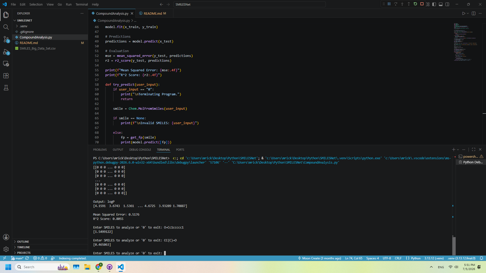
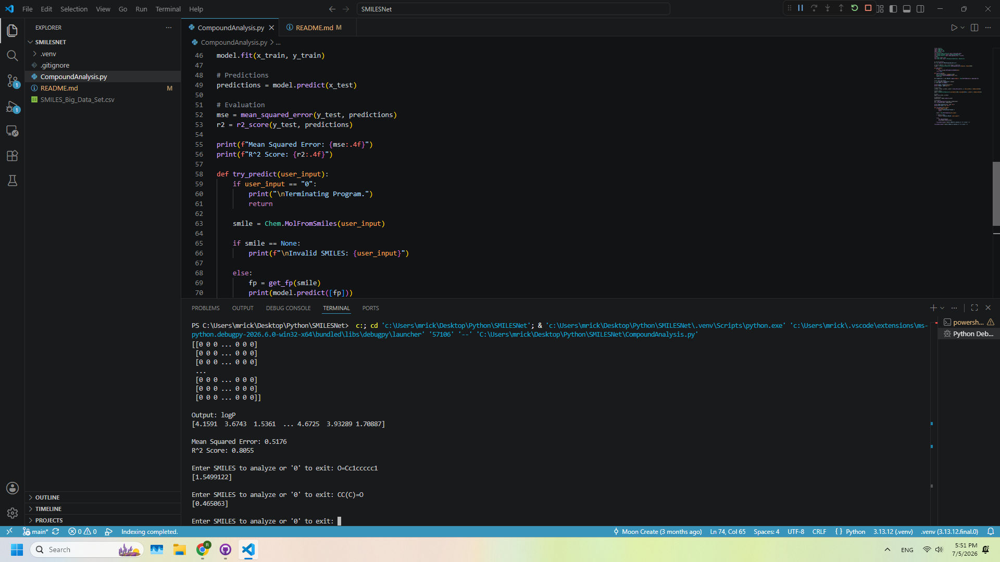

# SMILESNet
A machine learning model trained on Kaggle dataset to predict simple organic compound's solubility in water/oil.

# Context
SMILES is a string representation of chemical compounds. The purpose of this project is to experiment around with ML implementation in the field of cheminformatics. CompoundAnalysis.py takes in string input of SMILES, converts it to bit vector, then feeds it to random forest algorithm from scikit-learn library, to predict logP, the type of liquid in which the substance dissolves in - important in researching how the drug interacts with the body. Uses small organic compound dataset from Kaggle. The project helped in learning the chemistry library in Python, while getting more used to standard ML library like scikit-learn.

# Example
For getting the SMILES string of compound, I recomment using [this website](https://www.cheminfo.org/flavor/malaria/Utilities/SMILES_generator___checker/index.html), which allows you to interactively build molecules.

Analysis of Benzaldehyde:\

For many compounds, the prediction is relatively accurate. For instance, according to [National Library of Medicine](https://pubchem.ncbi.nlm.nih.gov/compound/240#section=Depositor-Supplied-Synonyms), the logP of Benzealdehyde is 1.5, which is very close to the predicted value of ~1.54 (meaning Benzaldehyde is hydrophilic).

However, for compounds with negative logP value, the prediction diverge from actual values.

Analysis of Acetone:\

Notice how the predicted value is significantly different from the [real value](https://pubchem.ncbi.nlm.nih.gov/compound/Acetone) of -0.1. This is likely due to the dataset's lack of extremely hydrophilic compounds (with logP < 0). This can likely be improved by changing the ML model to one that actually analyze the compound itself using 2D map like [this](https://pubs.acs.org/doi/10.1021/acs.jpclett.2c01913), but is beyond the scope of this project, which is only intended to be a simple prototype.